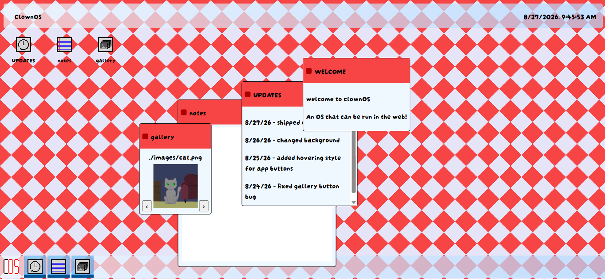

# webOS

I decided i wanted to try the webOS jam and ive always really liked when sites or games gave the desktop look.

 # about
 A simple webOS made with HTML, CSS, and JavaScript. It has 3 apps and 4 windows. The apps include a, welcome screen, an updates app, a notes app, and a gallery app.

 # how to use
 open link to github pages: https://clownoftheweekcode.github.io/webOS/

 # how i developed it
 I already knew some html,css and javascript but i still learned some things when developing this. I followed the guide and i added hover effects, made simple art for the gallery, and added styling for the bottom icons for when the window is opened so that it would be more personal.

 

